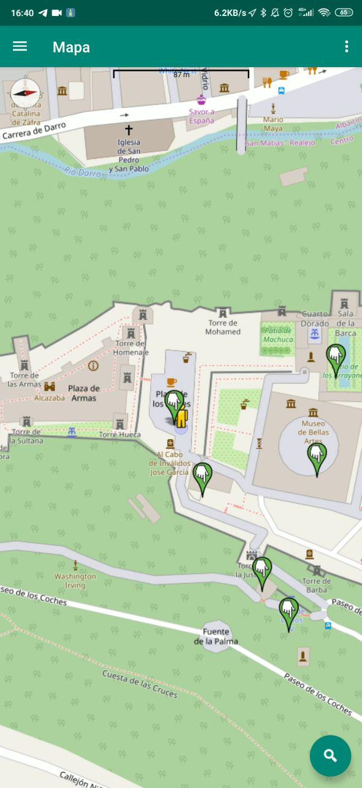
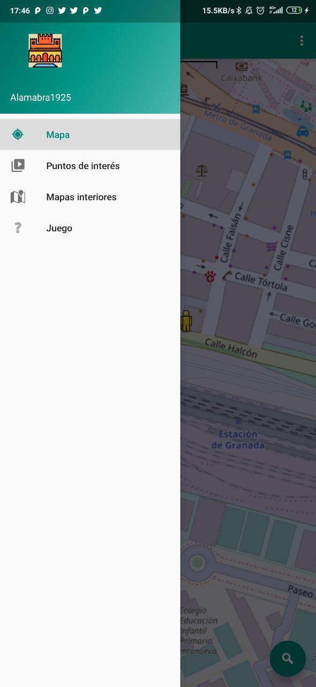
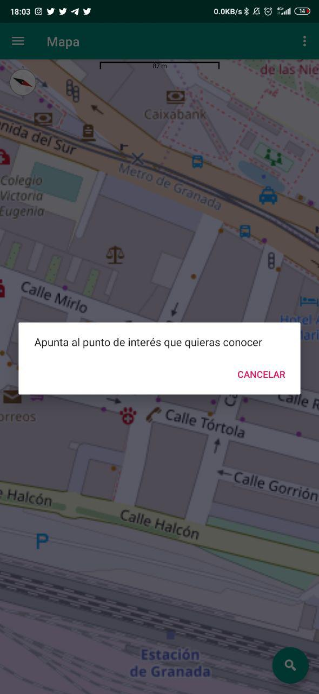
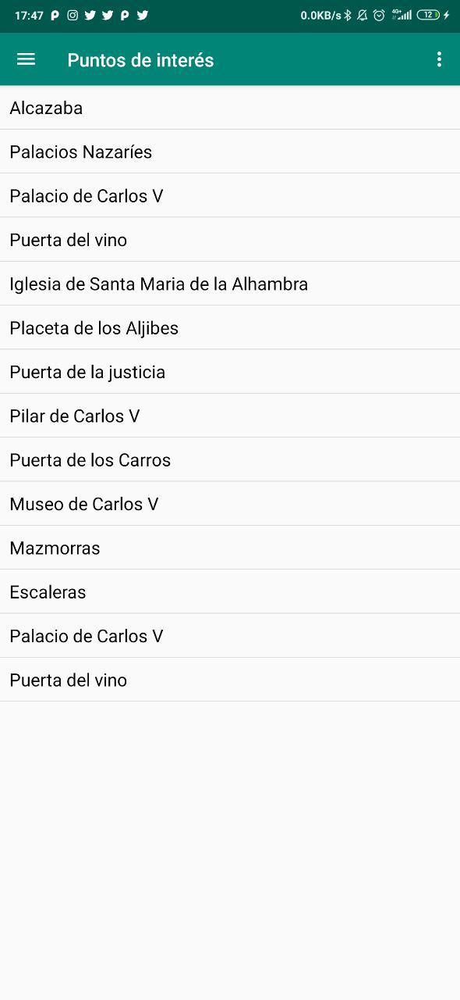
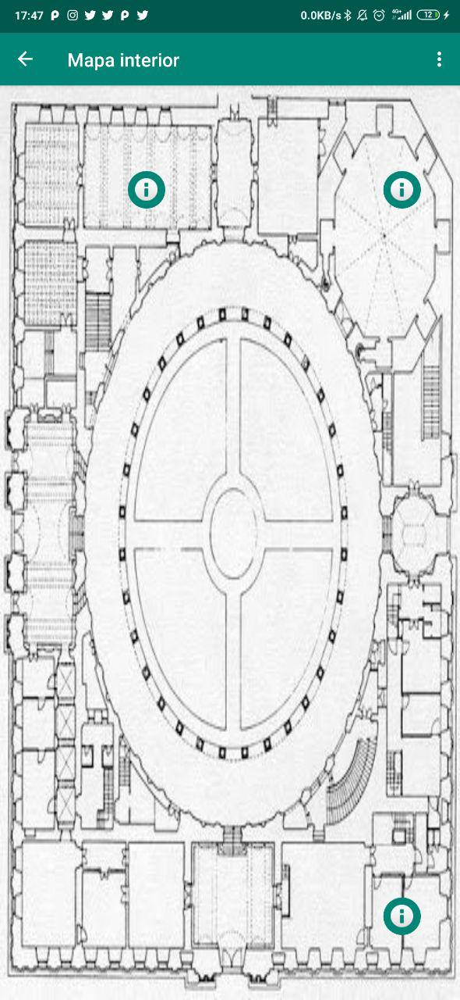

El objetivo de la práctica es realizar un software capaz de complementar una visita a la Alhambra de Granada haciendo uso de paradigmas de interacción no convencionales, para ello se desarrollará una aplicación para teléfonos móviles.

La principal característica de la aplicación es proveer al usuario de un mapa donde su localización se encuentra reflejada en tiempo real. 
En el mapa quedan reflejadas aquellos puntos de interés de una visita a la Alhambra. Con ello buscamos que el usuario no se pierda ningún monumento importante de la Alhambra.

El usuario puede obtener información acerca de un punto de interes de distintas formas:

- Los puntos de interes del mapa se pueden pulsar, obteniendo una vista con toda la información acerca de dicho puntos de interés.
- El usuario puede obtener información acerca de un punto de interés apuntando hacia él con el dispositivo movil. En caso de no tener contacto visual con el punto de interés, el usuario podrá ayudarse de la brujula presente en el mapa para intuir la direccion en la que se encuentra y utilizar el gesto igualmente. Con esto se intenta que aquellos usuarios que les resuelte complicado interactuar con el mapa puedan obtener información de lo que estan viendo en cualquier momento, ya que solo apuntando con el móvil al monumento consigues información de este.
- Es posible acceder a una lista de todos los puntos de interes y obtener información de cualquiera de ellos desde la misma. Alternativa bastante útil para conocer puntos de interés lejanos si necesidad de tenerlos cerca.

   

El usuario no tendrá que preocuparse por la señal GPS recibida por la aplicación cuando se adentre en un lugar cubierto.
La aplicación detectará el descenso de señal GPS y cargará un mapa interior del lugar donde, aunque el usuario no pueda saber su localización exacta, también aparecerán distintos puntos de interés, situados dentro de los monumentos de la Alhambra.

 

La aplicación dispone de un juego pensado para los mas pequeños, en este se nos mostrarán diversas preguntas de respues rápida sobre la visita a la Alhambra, estas preguntas deberán responderse en un corto periodo de tiempo (30 segundos) representada con una barra de color amarillo que va aumentando segun van pasando los segundos. Para aumentar la sensación de frenesí, las preguntas se deberán responder utilizando un gesto con el dispositivo.
- En caso de querer responder afirmativamente a la pregunta, se deberá mover el dispositivo hacia adelante y hacia atrás, con un movimiento de 90 grados.
- En caso de querer responder negativamente, se utilizará un movimiento de lado a lado, con un moviemiento de 90 grados.

Tras una serie de preguntas la puntuación total es mostrada en pantalla, permitiendo al usuario volver a jugar para intentar conseguir una puntuación más alta.

  
