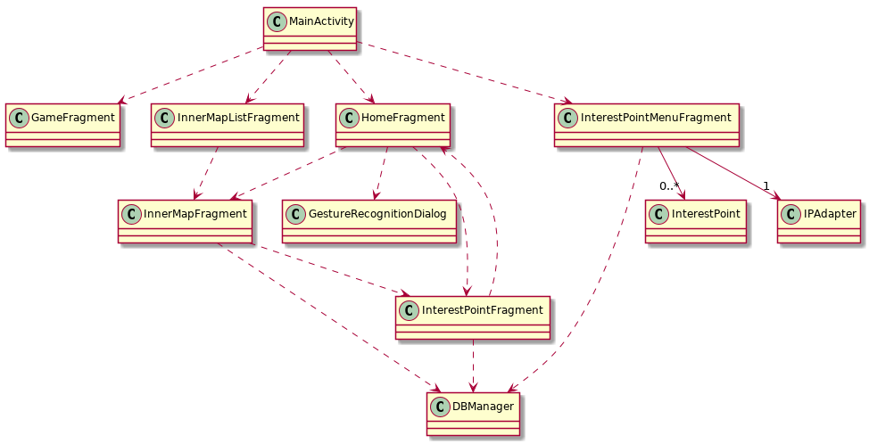

Estructura del proyecto
=======================

La aplicación `Alamabra1925` está implementada como un proyecto
`Android` en `Kotlin`. El proyecto se encuentra estructurado en una
única actividad `MainActivity` y una serie de fragmentos, cada uno de
ellos encargado de una faceta de la aplicación. Estos son:

-   `HomeFragment`.
-   `InnerMapListFragment`.
-   `InnerMapFragment`.
-   `InterestPointFragment`.
-   `InterestPointMenuFragment`.
-   `GameFragment`.

Todos los fragmentos y las interacciones entre ellos se llevan a cabo
utilizando un \"controlador de navegación\". Este nos permite navegar
entre los fragmentos desde la barra de navegación lateral.

Desde esta barra podemos acceder a `HomeFragment` (Map),
`InnerMapListFragment` (Inside Maps) y `GameFragment` (Game).

A continuación mostramos el diagrama correspondiente a las
comunicaciones entre cada uno de los fragmentos.


Simbolizaremos con flechas continuas la cantidad de veces que una clase
contiene a la otra. Debido a la estructura con fragmentos del proyecto
esto solo ocurre con la clase `InterestPointMenuFragment`. Por esto,
hemos decidido simbolizar en el diagrama las comuninaciones entre las
clases. Para ello usaremos lineas discontinuas.



Fragmentos
==========

HomeFragment
------------

InnerMapFragment
----------------

En este fragmento se implementan los mapas internos junto con sus puntos de interés. 
A este podemos llegar desde `HomeFragment` o `InnerMapListFragment`, en ambos casos será necesario añadir un identificador `id` al `bundle` de la navegación, este simbolizará cual de los mapas interiores queremos cargar.

Para esto utilizamos
```
val mid = arguments!!.get("id")
```

También lo utilizaremos para saber cual de los conjuntos de puntos de interes debemos cargar en la vista del mapa.

Para añadir estos puntos utilizamos la función `addFloatingButton`, que nos permitirá utilizar los valores presentes en la base de datos para colocarlo correctamente en la vista. Para ello seguiremos los siguientes pasos:
+ Crear un `floatingActionButton`.
+ Crear un `relativeLayout` sobre el que añadir los márgenes.
+ Establecer el layout al botón.
+ Añadir ciertas características del boton, como el icono, el tamaño y los colores.
+ Establecer el `Listener` de pulsación para lanzar la vista del punto de interés correspondiente.

InnerMapListFragment
--------------------

InterestPointFragment
---------------------

Este fragmento nos permite visualizar toda la información acerca de un
punto de interés concreto de nuestra visita. En el método `onCreateView`
del fragmento, esperamos un `Bundle` con un identificador que nos
permita conocer de que fragmento se debe mostrar la información.

Con esto utilizamos la base de datos para rellenar los `textView`
apropiados.

InterestPointMenuFragment
-------------------------

A este fragmento se puede acceder desde la barra de navegación lateral
bajo el nombre de `Interest Points Menu`. Aquí obtendremos una lista de
todos los puntos de interés de os que se tiene información en la
aplicación. Para ello utilizamos un adaptador `IPAdapter` y la base de
datos.

Cada uno de los puntos de la lista tiene sobrecargado el listener de
pulsación, haciendo que sea posible ir a la vista detallada de cada uno
de ellos.

En el método `onCreateView` hacemos lo siguiente.

``` {.Kotlin}
val mainList = root.findViewById<ListView>(R.id.list_view)
listAdapter = IPAdapter(this.context!!, list)
mainList.adapter = listAdapter

mainList.onItemClickListener = AdapterView.OnItemClickListener { _, _, position, _ ->
    val bundle = bundleOf("id" to list[position].id)
    findNavController().navigate(R.id.action_nav_ip_menu_to_nav_ip, bundle)
}

loadQueryAll()
```

-   Inicializamos la variable correspondiente a la vista de la lista.
-   Inicializamos nuestro adaptador. Y se lo asignamos a la lista.
-   Sobrecargamos el listener de pulsación de forma que utilice
    controlador de navegación para cargar el fragmento del punto de
    interés correspondiente.
-   Utilizamos `loadQueryAll` para rellenar la lista con los puntos de
    interés de la base de datos.

GameFragment
------------

En este fragmento el usuario se enfrenta a una serie de preguntas que
tendrá que responder lo más rápido posible.

Otras clases
============

InterestPoint
-------------

Esta clase corresponde a una simple abstracción de la información
almacenada en un punto de interés.

``` {.Kotlin}
data class InterestPoint(
        var id : Int,
        var title: String,
        var content : String
)
```

IPAdapter
---------

Esta clase extiende a la clase `BaseAdapter`. La utilizamos en el
fragmento correspondiente a la lista de puntos de interés
`InterestPointMenuFragment` donde mostramos uan lista de todos los
puntos de interes que se encuentran en la base de datos. El adaptador
nos permite mostrar estos elementos en la lista de una forma más cómoda
y personalizable. Podriamos haber utilizado un `ArrayAdapter` como se ha
hecho en la lista de mapas interiores `InnerMapListFragment`, sin
embargo, esto bloqueaba la escalabilidad de la aplicación a la hora de
querer mostrar mas información en la lista (por ejemplo, imágenes o un
resumen del contenido).

DBManager
---------

Esta clase nos permite utilizar la API de `SQLite` para almacenar los
puntos de interés de nuestra aplicación. Dado que estos no cambian a lo
largo de la ejecución podríamos haber utilizado un vector que los
almacenara, sin embargo, vimos mas conveniente este modelo, debido a que
todos los fragmentos se pueden valer de la misma base de datos (por
tener solo una actividad) y no tenemos que preocuparnos de tener un
vector al que todos pudieran acceder.

La información almacenada en la base de datos es:

-   Un identificador numérico. La clave primaria.
-   El nombre del punto de interés.
-   Toda la información al respecto del mismo.
-   Su possición.
    -   Se utiliza un valor numérico para indicar si el punto de interes
        se encuentra en el interior o dentro de algún edificio.
    -   En el caso de ser un punto exterior, se utilizan latitud y
        longitud para determinarla.
    -   En caso de ser un punto interior, se utilizan un sistema de
        márgenes para posicionarlo en el mapa.

La clase dispone de 3 métodos importantes, todos ellos nos devuelven un
cursor iterable sobre las filas resultantes en la base de datos.

-   `queryById`. Nos permite obtener un punto de interés a partir de su
    ID.
-   `queryByLocationType`. Nos permite obtener todos los puntos de
    interés que se encuentren en el exterior o dentro de un mismo
    edificio.
-   `queryAll`. Nos permite obtener todos los puntos de interés.

GestureRecognitionDialog.
-------------------------
Esta es la clase que abre el diálogo al pulsar el botón para reconocer
un punto de interés al hacer el gesto de [apuntar]{.underline}, y que
gestiona dicho gesto y su funcionalidad.

En primer lugar, para reconocer el gesto utilizamos dos sensores, el **acelerómetro**, y el sensor de **campo magnético**. Para ello, definimos el *listener* `mPositionListener`. Este, una vez que posee datos no nulos de ambos sensores, comprueba que el movil está en posición horizontal o más inclinado (como si apuntaras al suelo), lo que nos indica que el usuario ha realizado el gesto. Una vez reconocido el gesto, almacena el ángulo del movil respecto al polo norte, lo que nos permitirá luego reconocer el punto de interés señalado. Tras esto, hace una petición de ubicación, y el *listener* de la ubicación será el encargado de identificar dicho punto de interés.

El *listener* encargado de obtener la ubicación actual del usuario es `mLocationListener`. Trataremos los valores de latitud y longitud como si fueran coordenadas sobre un plano. Dicho esto, una vez que conocemos la posición actual, calculamos el vector director de la semirecta que comienza en nuestra localización, y apunta en la dirección en la que apunta el movil (utilizando el ángulo entre el eje X del teléfono y el polo norte almacenado anteriormente). Entonces, para reconocer a qué punto de interés estamos apuntando, descartamos los puntos que se quedan por detrás, calculamos la distancia a la semirrecta del resto y almacenamos el identificador del punto de interés que esté mas cerca de esta.

Por último, cerramos el diálogo y abrimos la vista asociada a la información de dicho punto de interés.
